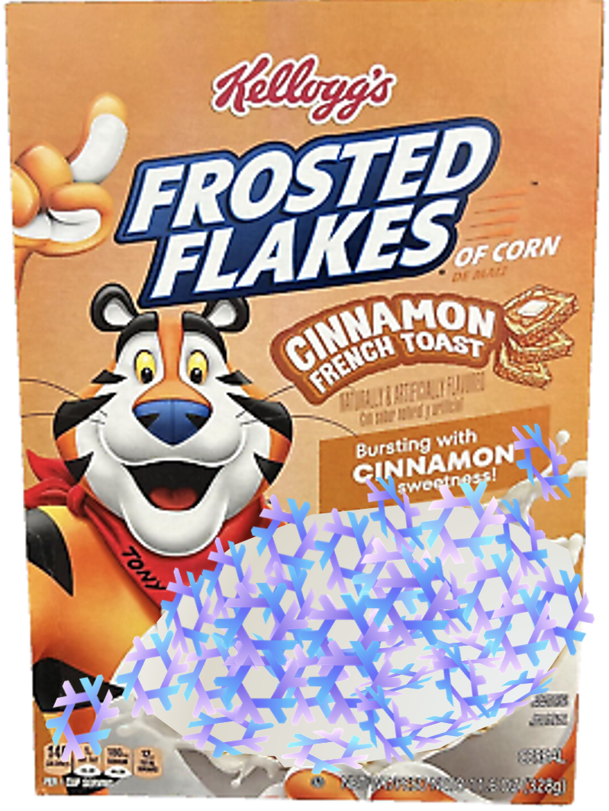

# 🥣 Frosted Flakes 🥶✨

**"They're more than good... they're declaratively great!"**

<details>
<summary>Logo</summary>

</details>

## 📖 Table of Contents

**Because Even Chaos Needs Structure**

<!-- vim-markdown-toc GFM -->

- [🌀 What is Frosted Flakes?](#-what-is-frosted-flakes)
- [🏆 Why Choose Frosted Flakes?](#-why-choose-frosted-flakes)
- [📦 Included Packages](#-included-packages)
  - [🖥️ Configurations (Your Editors & Terminal, Pre-Loaded)](#-configurations-your-editors--terminal-pre-loaded)
  - [🛠️ Utilities (Small but Mighty)](#-utilities-small-but-mighty)
  - [📁 Navigation & File Management](#-navigation--file-management)
  - [🔧 Dev & Productivity Tools](#-dev--productivity-tools)
  - [🔢 Miscellaneous (But Still Awesome)](#-miscellaneous-but-still-awesome)
  - [🏆 The Ultimate Flake](#-the-ultimate-flake)
- [🚀 Getting Your Daily Dose of Flakes](#-getting-your-daily-dose-of-flakes)
  - [🍽️ Running with `nix shell`](#-running-with-nix-shell)
  - [🛠️ Installing a Single Package](#-installing-a-single-package)
  - [📦 Applying as an Overlay](#-applying-as-an-overlay)
- [📜 License](#-license)
- [🔗 Links](#-links)

<!-- vim-markdown-toc -->

## 🌀 What is Frosted Flakes?

**Why this flake collection is better than your average cereal**

Frosted Flakes is a **deliciously modular** collection of all my **Nix flake packages**. Whether you want just one or the whole cereal box, it's easy to use:

- **Each package is individually runnable**
- **All packages are exposed as overlays**
- **Install everything at once with `frosted-flakes`**

## 🏆 Why Choose Frosted Flakes?

**Convince yourself that this is the right choice**

- ✅ **Flake-powered goodness** – No impurities, just pure Nix magic.
- ✅ **Easily deployable** – No Home Manager required. Just add & go.
- ✅ **Tastes better than imperative package management.**

## 📦 Included Packages

**A.K.A. The Good Stuff**

Because what’s a flake collection without actual flakes? Here’s what’s inside:

### 🖥️ Configurations (Your Editors & Terminal, Pre-Loaded)

> 💡 **Need a zsh setup that slaps right out the box?**
> Check out [shellConfig](https://github.com/NewDawn0/shellConfig) for a shell so slick it basically types for you. 🐚💨

- **[hxConfig](https://github.com/NewDawn0/hxConfig)** – Helix so prepped, you’ll think it's reading your mind. Minimal setup, max vibe. 🧠✨
- **[nvimConfig](https://github.com/NewDawn0/nvimConfig)** – Neovim with _actual superpowers_. Looks good, feels good, works like black magic. 🔮
- **[vscodeConfig](https://github.com/NewDawn0/vscodeConfig)** – VS Code, but already knows what extensions you’ll install anyway. 📦🔍
- **[tmuxConfig](https://github.com/NewDawn0/tmuxConfig)** – Like tmux... but with taste. Windows, panes, and keybinds that make sense. 🪟🔧

### 🛠️ Utilities (Small but Mighty)

- **[cheat.s](https://github.com/NewDawn0/cheat.s)** – A cheatsheet for when your brain has more memory leaks than your code
- **[asciiWeather](https://github.com/NewDawn0/asciiWeather)** – A screensaver that shows weather using ASCII art. Stay informed, the retro way. ☁️

### 📁 Navigation & File Management

- **[ex](https://github.com/NewDawn0/ex)** – One command to extract them all (ZIP, TAR, and more). 🗃️
- **[shredder](https://github.com/NewDawn0/shredder)** – Secure file deletion for the truly paranoid. 🕵️

### 🔧 Dev & Productivity Tools

- **[gen](https://github.com/NewDawn0/gen)** – Quickly generate project templates with customizable settings. 🚀
- **[note](https://github.com/NewDawn0/note)** – Jot down quick notes without cluttering your system. 📝
- **[notify](https://github.com/NewDawn0/notify)** – Create forms and send notifications from the CLI. 🔔
- **[translate](https://github.com/NewDawn0/tl)** – Translate text directly from the command line. No GUI needed. 🌍
- **[vocab](https://github.com/NewDawn0/vocab)** – Learn and memorize vocabulary efficiently. Your CLI is now a teacher. 📖

### 🔢 Miscellaneous (But Still Awesome)

- **[nixieClock](https://github.com/NewDawn0/nixieClock)** – A CLI clock that looks like vintage Nixie tubes. ⏳
- **[pac](https://github.com/NewDawn0/pac)** – ASCII Pac-Man banner + speed comparisons in different languages (C, Rust, Zig, etc.). 🏁👾

### 🏆 The Ultimate Flake

- **[frosted-flakes](https://github.com/NewDawn0/frostedFlakes)** – The complete collection. Just install this and enjoy all the goodness at once.

## 🚀 Getting Your Daily Dose of Flakes

**How to consume these flakes without milk**

### 🍽️ Running with `nix shell`

**Try before you buy—except it's free**

```sh
nix shell github:NewDawn0/frostedFlakes
```

This gives you access to all the included packages in an ephemeral environment.

### 🛠️ Installing a Single Package

**Only want one flake? We got you.**

Each package is available individually, so you can grab just what you need:

```sh
nix shell github:NewDawn0/frostedFlakes#somePackage
```

### 📦 Applying as an Overlay

**Because managing packages declaratively is just ✨better✨**

Want to add all these flakes to your system like a good Nix enjoyer? Just apply the overlay:

```nix
{
    # Add the input to your flake
    inputs.frosted-flakes.url = "github:NewDawn0/frostedFlakes";
    # Then set the overlays
    nixpkgs.overlays = [ inputs.frosted-flakes.overlays.default ];
}
```

Now you can install anything from the collection using `nix-env` or `nix shell` as usual.

## 📜 License

**I legally protect myself while you enjoy flakes**

MIT – **Do whatever you want, just don’t sue me if you choke on a flake.**

## 🔗 Links

**Click things. Go places.**

🍴 **GitHub:** [github.com/NewDawn0/frostedFlakes](https://github.com/NewDawn0/frostedFlakes)
